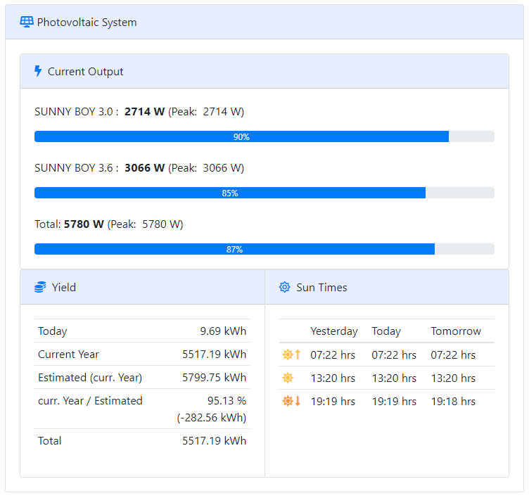

# mbpv - modbus photovoltaic (unit reader)
A  [raspend](https://github.com/jobe3774/raspend) based application for reading out current values of my PV units inverters via Modbus-TCP. These values are exposed as a JSON string via HTTP, so that they can be displayed in a user interface like shown below.

For Modbus communication it uses [pyModbusTCP](https://github.com/sourceperl/pyModbusTCP).

The calculation of sunrise and sunset is based on SunMoon.py by Michael Dalder, which in turn is a port of Arnold Barmettler's JavaScript. See [here](https://lexikon.astronomie.info/java/sunmoon/) for more information.

My PV system uses two inverters of *SMA Solar Technology AG*. These are the models Sunny Boy 3.0 and 3.6 (SB3.0-1AV-40 (9319) / SB3.6-1AV-40 (9320)). Therefore **mbpv** is tailored to these inverters, but should be easily adaptable to other inverters that support Modbus-TCP. Check *SMA_Inverters.py* for the Modbus registers I used. Modify them or replace *SMA_Inverters.py* by your own implementation.

## Configuration

**mbpv** uses a JSON configuration file. The current configuration has the two mandatory nodes *Unit* and *Inverters*. The latter is just an array holding the node names for each inverter belonging to the current PV system. See *mbpv_config.json* for an example configuration.

### Unit
``` json
  "Unit": {
    "startUp": "2019-02-27", 
    "location": {
      "longitude": 6.0838868,
      "latitude": 50.7753455
    },
    "expectedYieldKWHperKWP": 925,
    "peakOutputInWP": 6270
  }
```
Key|Value
---|-----
startUp | the day of the first start of the PV system
location | the geocoordinates of the system (needed for sun time calculation)
expectedYieldKWHperKWP | the expected number of kWh per kWP for the location
peakOutputInWP | the maximum power the system is able to generate

### Inverters
As already mentioned, the node *Inverters* is only an array with the names of the nodes defining the inverters of the PV system. In the example below, we would have nodes named *sunnyboy1* to *sunnyboy3*. 

``` json
  "Inverters": [
    "sunnyboy1",
    "sunnyboy2",
    "sunnyboy3"
  ],
```
Each inverter's node has the following structure:

``` json
  "sunnyboy1": {
    "totalYieldLastYear": 0,
    "inverter": {
      "name": "SUNNY BOY 3.0",
      "host": "sunny-boy-30",
      "port": 502,
      "unitId": 1,
      "maxOutput": 3000
    },
    "maxPeakOutputDay": 0,
    "totalYieldCurrYear": 0,
    "dayYield": 0,
    "totalYield": 0,
    "currentOutput": 0,
    "internalTemperature": 0.0,
    "currentState": "ok",
    "maxPeakTime" : "HH:MM"
  },
  ...
  "sunnyboy2": {
  },
  ...
```
Key | Value 
----|-------
totalYieldLastYear|holds the total yield until change of the year
totalYieldCurrYear|holds the total yield since change of the year
dayYield|the yield of the current day
totalYield|sum of totalYieldLastYear and totalYieldCurrYear
currentOutput|current output of the system
maxPeakOutputDay|the peak output of the day
internalTemperature|the inverter's internal temperature
currentState|the inverter's current operating state
inverter| subnode containing relevant information regarding the inverter's Modbus configuration
maxPeakTime|the time of inverter's peak

When creating a first configuration file, all keys but the inverter key can be omitted since **mbpv** creates them for you. 

### Inverter

``` json
    "inverter": {
      "name": "SUNNY BOY 3.0",
      "host": "sunny-boy-30",
      "port": 502,
      "unitId": 1,
      "maxOutput": 3000
    },
```
Key | Value 
----|-------
name | Name
host | IP address or hostname
port | Modbus-TCP port (default: 502)
unitId | Modbus unit id
maxOutput | maximum output of the inverter in watts

### PVOutput.org

If you have added your PV system to [pvoutput.org](https://www.pvoutput.org/), you can add a respective node containing your systemId and your [apiKey](https://www.pvoutput.org/help.html#api). Since this node is removed from the [shared dictionary](https://github.com/jobe3774/raspend#how-to-use-the-http-interface) during runtime, it will not be exposed via HTTP.

``` json
  "PVOutput.org": {
    "apiKey": "secret-api-key",
    "systemId":  1234567890
  }
```

## Usage

If not done yet, install [raspend](https://github.com/jobe3774/raspend) first:
```
$ pip3 install raspend
```
Please see *requirements.txt* for more information about other dependencies.

Start **mbpv** as follows:
```
$ python3 mbpv.py --port=8080 --config=./mbpv_config.json --peaklog=./peaks.csv
```
Parameter|Description
---|---
--port | the port number raspends HTTP server should listen on (required)
--config | path to the configuration file (required)
--peaklog | path to a file where to log the daily peak output as comma separated values (required) 

Then open your favourite browser and type:
```
http://localhost:8080/data
```
You get a JSON response, which contains most of the above values, extended by a node "Suntimes" (explained below).

``` json
{
  "Unit": {
    "startUp": "2019-02-27",
    "location": {
      "longitude": 6.0838868,
      "latitude": 50.7753455
    },
    "expectedYieldKWHperKWP": 925,
    "peakOutputInWP": 6270
  },
  "Inverters": [
    "sunnyboy1",
    "sunnyboy2"
  ],
  "sunnyboy1": {
    "totalYieldLastYear": 0,
    "inverter": {
      "name": "SUNNY BOY 3.0",
      "host": "sunny-boy-30",
      "port": 502,
      "unitId": 1,
      "maxOutput": 3000
    },
    "maxPeakOutputDay": 155,
    "totalYieldCurrYear": 2763865,
    "dayYield": 968,
    "totalYield": 2763865,
    "currentOutput": 155,
    "internalTemperature": 34.5,
    "currentState": "ok",
    "maxPeakTime": "14:23"
  },
  "sunnyboy2": {
    "totalYieldLastYear": 0,
    "inverter": {
      "name": "SUNNY BOY 3.6",
      "host": "sunny-boy-36",
      "port": 502,
      "unitId": 1,
      "maxOutput": 3600
    },
    "maxPeakOutputDay": 170,
    "totalYieldCurrYear": 3031643,
    "dayYield": 1064,
    "totalYield": 3031643,
    "currentOutput": 169,
    "internalTemperature": 35.8,
    "currentState": "ok",
    "maxPeakTime": "14:23"
  },
  "Suntimes": {
    "today": [
      1575184500,
      1575199500,
      1575214440
    ],
    "yesterday": [
      1575098040,
      1575113040,
      1575128040
    ],
    "tomorrow": [
      1575271020,
      1575285900,
      1575300780
    ]
  }
}
``` 
### Suntimes

This node has three subnodes *today*, *yesterday* and *tomorrow*, all containing an array of three unix timestamps, which are the times for sunrise, sun's upper culmination for the given location (see [*Unit*](https://github.com/jobe3774/mbpv#unit)) and sunset. The timestamps are in UTC.

Here you can see a screenshot of the frontend I wrote for displaying the data collected by mbpv.



# License

MIT. See LICENSE file.